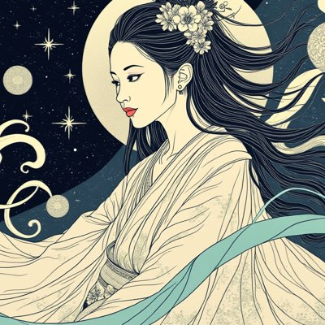
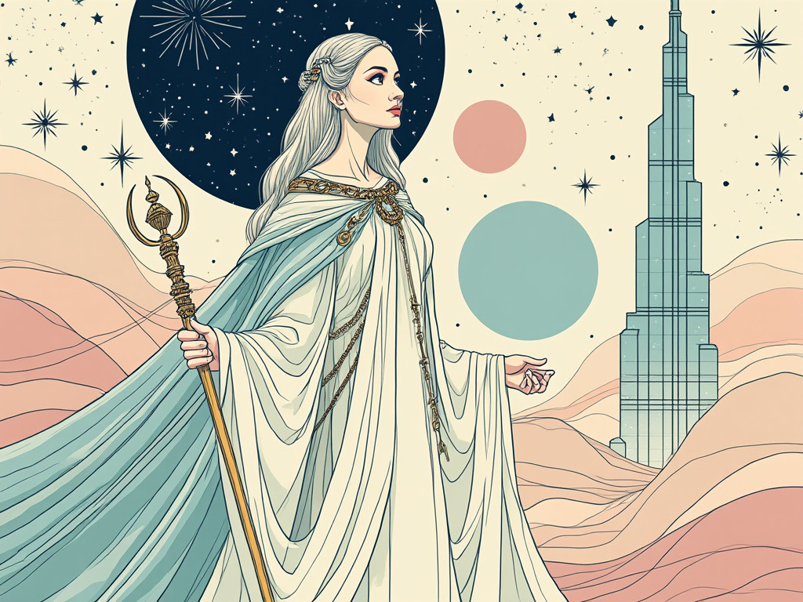
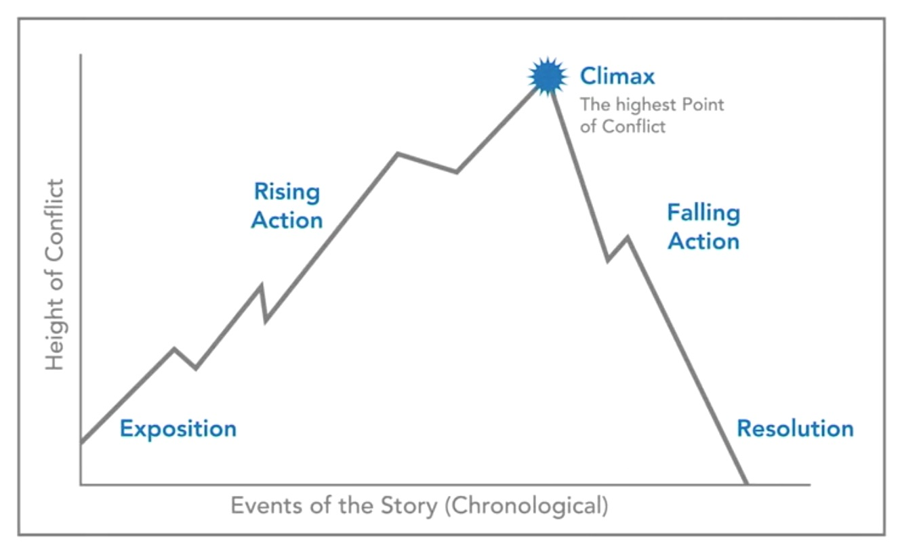
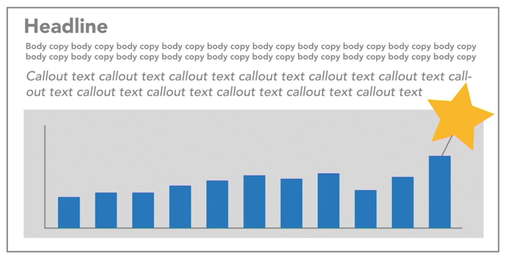

<h1 align="center">
  <a href="https://www.instagram.com/kannonsea/">
    </a><br>
  <b>kannon: storytelling engaging aesthetic</b><br>
	
  <b>An AI Tool For Learning</b><br>
</h1>

<p align="center">
  📸 <a href="https://www.instagram.com/kannonsea/">[Instagram]</a> |
  𝕏 <a href="https://x.com/kannonsea">[X]</a> |
  🌊 <a href="https://x.com/tokiollm">[Dev]</a>
</p>

Kannon is an AI-powered tool for transforming ideas, concepts, and data into visually engaging stories inspired by Japanese aesthetics. 

## Example Outputs Of Kannon Aesthetics
Here are some sample visualizations generated by Kannon:




## Features

- **Zen Garden Timeline**: Visualize project progress with a Zen-inspired design.
- **Wave Connections**: Map interconnected nodes with artistic flowing waves.
- **Sumi-e Storytelling**: Generate narrative-driven storyboards inspired by sumi-e art.

## Installation

1. Clone the repository:
   ```bash
   git clone https://github.com/tokiollm/kannon.git
   
# Data Visualization: Storytelling

## **Section 1: Why Storytelling**

### Humans are wired for story
	•	Evoke and dissolve unease through crafted tension.
	•	Potent narratives engineer discord only to harmonize it.
	•	Stories ignite neural pathways, mimicking the sensory symphony of lived experience—sights, sounds, flavors, and motion entwined.

Fiction vs nonfiction (journalistic or documentary storytelling, or data storytelling)

	•	Such tales transcend disbelief, forging conviction in their wake.
	•	The craft of storytelling was a lifeline for early humanity.
	•	Its evolutionary mandate is unmistakable.
	•	Embrace the lens of the storyteller.

### Storytelling is essential

	•	Studies reveal humans devote 70–80% of their waking hours to the art of communication.
	•	Communication reigns supreme as the most sought-after skill.
	•	A story imprints itself on memory 22 times more deeply than raw facts alone — Jennifer Aaker.
	•	Mundane words (e.g., “chair”) stir only the linguistic centers of the brain.
	•	Sensory words (e.g., “coffee”) awaken neural pathways tied to taste, scent, and experience.
	•	The broader the brain’s activation, the more vivid, emotional, and resonant the story becomes.
	•	Statistics function like neutral words: informative, but inert.

Interweave data with narrative and awaken the senses. This synthesis ignites thought, emotion, and imagery, embedding the content deeply and irresistibly in the mind.

[Narrative Visualization: Telling Stories with Data](http://vis.stanford.edu/files/2010-Narrative-InfoVis.pdf)

### Use story even when you don't



	•	At its core, every tale demands a genesis, a journey, and a resolution.
	•	Yet, beneath this simplicity lies a deeper cadence: the trials of the protagonist and the crescendo where all tensions converge.



	•	The yellow highlight marks the story’s resolution, its final note.
	•	The headline serves as the tale’s opening chord.
	•	The body text unfolds the journey, the middle passage.
	•	The callout text strikes the story’s apex, the moment of peak tension.
	•	Headlines, callouts, and highlights are potent tools to inject the essential spark: anxiety.
